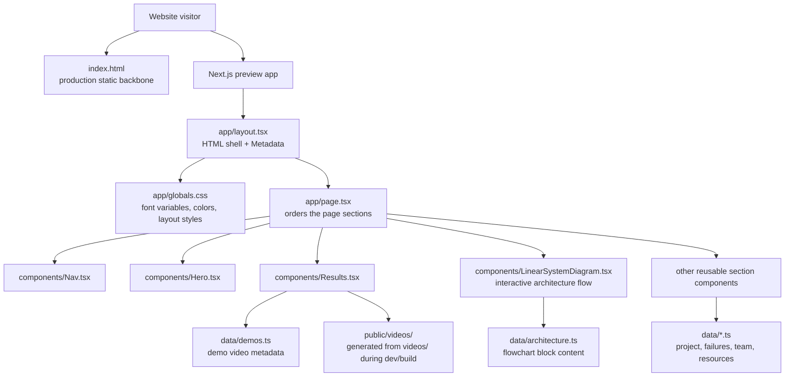

# Autonomous Safe Drone Following · CS 106A

Project site for our EE/CS 106A Spring 2026 final project. The repo keeps the original static `index.html` as a vanilla reference, but the deployable front-end is now the Next.js/TypeScript version in `app/`, `components/`, and `data/`.

**Live:** https://cs106a-drone-convoy.vercel.app

## What this repo contains



- `index.html` — the original vanilla/static reference page used for visual and content comparison
- `app/`, `components/`, `data/` — the deployable Next.js / TypeScript front-end, split into reusable content and UI modules
- `app/layout.tsx` — the root Next.js layout; it wraps every route, sets the `<html>` / `<body>` shell, and exports `metadata` for the browser tab, SEO summaries, and social/link previews
- `app/page.tsx` — the homepage composition file; keep it small and use it to order reusable sections, including `LinearSystemDiagram`
- `components/LinearSystemDiagram.tsx` — the interactive front-end architecture / system-flow component; keep the diagram UI here instead of mixing it into `page.tsx`
- `app/globals.css` — the reusable design layer for colors, spacing, responsive grids, and page fonts
- `videos/` — the 5 demo clips referenced by the current static page (~15 MB)
- `public/videos/` — generated locally/Vercel from `videos/*.mp4` by `npm run sync:videos`; ignored by Git so PR creation does not need to upload duplicate binary files
- `tello-station.sh` — switches a Tello between AP and station mode (real hardware)
- `tt_show_aruco.py` — renders an ArUco marker onto a RoboMaster TT's 8×8 LED matrix

The actual ROS 2 / Gazebo project source lives in its own repo:
[Tyler6666666/106a_final_project](https://github.com/Tyler6666666/106a_final_project).

## Reusable Next.js structure

Use the Next.js files as a component map of the static site. The most important rule is: `page.tsx` decides **what appears and in what order**, while `components/` decide **how each section behaves and looks**.

```txt
app/layout.tsx
  └── app/page.tsx
        ├── components/Nav.tsx
        ├── components/Hero.tsx
        ├── components/IntroMotivation.tsx
        ├── components/Results.tsx
        ├── components/LinearSystemDiagram.tsx
        ├── components/PerceptionSafety.tsx
        ├── components/FailuresImplementation.tsx
        └── components/FutureTeamResources.tsx
              └── data/*.ts content modules
```

### What `metadata` does in `app/layout.tsx`

`metadata` is a typed Next.js export. Next.js reads it while building/rendering the route and turns it into document metadata such as the page `<title>` and description meta tag. In this repo it controls the browser-tab title and the short description that search engines, crawlers, and link-preview tools can read.

```tsx
export const metadata: Metadata = {
  title: "Autonomous Safe Drone Convoy Following · CS 106A",
  description: "A ROS2-based visual servoing case study...",
};
```

Change it when the site name, class/project title, or summary changes. Do not put visible page content here; visible content belongs in `page.tsx`, components, or `data/` files.

### Where `page.tsx` should be

`app/page.tsx` is the reusable homepage assembly point. It should stay short and readable:

```tsx
export default function Page() {
  return (
    <>
      <Nav />
      <Hero />
      <main>
        <Introduction />
        <Motivation />
        <Results />
        <LinearSystemDiagram />
        <Perception />
        <Safety />
        <Failures />
        <Implementation />
        <Future />
        <Team />
        <Resources />
      </main>
    </>
  );
}
```

To reorder the homepage, move the component tags in this file. To edit the content of a section, go to that section's component or the matching file in `data/`.

### Where `LinearSystemDiagram` should be

`components/LinearSystemDiagram.tsx` is the correct home for the interactive architecture diagram. It imports `architectureBlocks` from `data/architecture.ts`, tracks the active block with React state, and renders the clickable linear flow. Keeping it in its own component makes it reusable on another page later without copying the homepage.

If you want to change the diagram text, edit `data/architecture.ts`. If you want to change diagram layout, spacing, or hover behavior, edit `components/LinearSystemDiagram.tsx` and the `.linearArch`, `.linearFlow`, `.linearNode`, and `.linearDetail` styles in `app/globals.css`.

## Rendering model: static export, not dynamic runtime rendering

This repo's Next.js config is set up for static export, so the production site is generated as static HTML/CSS/JS at build time. That matches the project-site use case: it is fast, cacheable, and easy to deploy because the content does not need per-request server computation.

**Dynamic runtime rendering** means the server generates some or all of a page when a visitor requests it instead of prebuilding every page ahead of time. It is useful for dashboards, authenticated pages, personalized content, frequently changing data, or pages that need request-time cookies/headers/database queries.

Effects dynamic runtime rendering can create on websites:

- fresher per-visitor or per-request content,
- personalization based on login/session/location/cookies,
- the ability to read live databases or APIs during the request,
- potentially slower first response than static files if the server must compute the page,
- more hosting/runtime complexity because a server or serverless function must run for requests,
- different caching behavior because not every response is identical for every visitor.

For this class project website, static rendering is usually preferable unless the site later adds user accounts, a live telemetry dashboard, live comments, or database-backed content.

## Changing page fonts

The simplest reusable font setup is in `app/globals.css`. The `:root` block defines named font variables, and the rest of the stylesheet uses those variables.

```css
:root {
  --font-sans: Inter, ui-sans-serif, system-ui, -apple-system, BlinkMacSystemFont, "Segoe UI", sans-serif;
  --font-display: Inter, ui-sans-serif, system-ui, sans-serif;
  --font-mono: ui-monospace, SFMono-Regular, Menlo, monospace;
}

body {
  font-family: var(--font-sans);
}

h1,
h2 {
  font-family: var(--font-display);
}
```

To change fonts across the page:

1. Open `app/globals.css`.
2. Replace `--font-sans` for body text.
3. Replace `--font-display` for headings.
4. Replace `--font-mono` for eyebrow labels, captions, and technical text.
5. Save and run `npm run dev` to preview the change.

Example: to make headings use Georgia while keeping body text system sans-serif:

```css
:root {
  --font-sans: Inter, ui-sans-serif, system-ui, sans-serif;
  --font-display: Georgia, "Times New Roman", serif;
  --font-mono: ui-monospace, SFMono-Regular, Menlo, monospace;
}
```

If you later want downloaded web fonts, use `next/font` in `app/layout.tsx` and connect the generated class or CSS variables to the same `--font-*` variables. Keeping the rest of the CSS pointed at variables means the design can switch fonts without rewriting every selector.


## Troubleshooting PR creation and binary files

MP4 videos are binary files. Git can track them, but many PR-review and patch-application tools cannot display or transmit binary file additions the same way they handle text diffs. The original Next.js scaffold duplicated the already-tracked root `videos/*.mp4` files into `public/videos/*.mp4`, so the branch tried to add a second copy of each video as binary content. That is the likely reason the GitHub/Codex PR update flow showed a **Binary files are not supported** / **Failed to create pull request** error.

This branch now avoids that failure mode by keeping only the original `videos/*.mp4` files in Git. During local development and Vercel builds, `npm run sync:videos` generates `public/videos/` from those tracked originals. Because `public/videos/` is ignored, future PR diffs stay text-only for the Next.js scaffold while the app still gets public video URLs at runtime/build time.

`npm run dev` runs the Next.js development server. Because `package.json` defines `predev`, npm automatically runs `npm run sync:videos` first, then starts `next dev` for local preview with hot reload.

`npm run build` creates the production/export build. Because `package.json` defines `prebuild`, npm automatically runs `npm run sync:videos` first, then runs `next build`. With `next.config.ts` using `output: "export"`, the build writes a static export suitable for Vercel/static hosting.

## Hardware utility scripts

`tello-station.sh` is a Mac-oriented helper for real hardware setup. It expects the laptop to be connected to the Tello access point, verifies the current Wi-Fi network, pings `192.168.10.1`, enters Tello SDK mode, checks battery, and sends the SDK `ap <ssid> <password>` command so the drone reboots into station mode on a shared Wi-Fi network.

`tt_show_aruco.py` targets the RoboMaster TT / Tello Talent LED matrix. It checks that the laptop is on the `TELLO-*` Wi-Fi network, enters SDK mode over UDP, can clear the display or scroll text, and by default generates an OpenCV ArUco `DICT_4X4_50` marker as an 8×8 LED pattern so another drone/camera can track it.


## Resolving PR merge conflicts

When GitHub shows **Merge conflicts** on the PR page, do not merge yet. The screenshot indicates the PR branch is open, targets `revision_1`, and cannot be merged until the PR branch is reconciled with the current base branch. First inspect **Files changed** for conflicting files/reviewer comments, then inspect **Checks** to see whether CI is failing because of the conflicts or because of a real build/type issue.

### Option A: resolve in the GitHub PR page

Use the browser flow only for simple text conflicts:

1. Click **Resolve conflicts** next to the red merge-conflict badge.
2. For every file GitHub opens, remove the conflict markers (`<<<<<<<`, `=======`, `>>>>>>>`) and keep the correct final content.
3. Click **Mark as resolved** for each file.
4. Click **Commit merge**. GitHub commits the conflict resolution to the PR branch.
5. Wait for checks/Vercel preview to rerun, then review the preview before merging.

Avoid the browser resolver for complex conflicts in `index.html`, generated files, binary files, or conflicts that require running the Next.js build locally. Use the CLI flow instead so you can run tests before pushing.

### Option B: resolve from the CLI

In this Codex/container environment the repository lives at:

```bash
/workspace/cs106a-website
```

On your own machine, use the folder where you cloned the repo. The general CLI loop is:

```bash
cd /workspace/cs106a-website
# If this checkout does not have a GitHub remote yet, add/fix origin first:
# git remote add origin git@github.com:<owner>/<repo>.git

gh pr checkout 4
git fetch origin revision_1
git merge origin/revision_1
# resolve conflict markers in each conflicted file, then run checks:
npm install
npm run sync:videos
npm run typecheck
npm run build
git status
git add <resolved-files>
git commit -m "Resolve PR merge conflicts"
git push
```

Pushing to the same PR branch updates the existing PR automatically; you do not need to open a new PR. If you prefer rebase history, replace the merge step with `git rebase origin/revision_1`, resolve conflicts, run checks, then `git push --force-with-lease`.

### Helper script for PR review packets

To collect PR discussion and review comments into a local packet, run:

```bash
scripts/pr-feedback-workflow.sh 4
```

To also check out the PR branch and attempt the base-branch merge locally, run:

```bash
scripts/pr-feedback-workflow.sh 4 --sync-base
```

The script writes `.codex/pr-feedback/pr-4/next_steps.md`, `thread.md`, `review-comments.json`, and `issue-comments.json`. Those generated files are ignored by Git; use them as the checklist/prompt for the next Codex or manual editing pass. The script intentionally does not auto-edit source files because PR comments still need human judgment, but it automates collecting the request context and surfacing merge conflicts locally.

## Run locally

Install dependencies, generate the public video copy, and start the Next.js preview:

```bash
npm install
npm run dev
```

`npm run dev` first runs `npm run sync:videos`, which copies the existing root-level `videos/*.mp4` files into `public/videos/` for Next.js. The generated `public/videos/` directory is intentionally ignored by Git to avoid duplicate binary files in pull requests.

## Build, test, and run

```bash
npm run typecheck
npm test
npm run build
npm start
```

- `npm run typecheck` validates the Next.js/TypeScript files.
- `npm test` runs the lightweight Node server/API regression tests.
- `npm run build` runs `sync:videos` and then `next build`; with `output: "export"`, Next.js emits the static site into `out/`.
- `npm start` is only for serving the Next.js production build locally. Vercel should use the build command, not a custom start command.

## API

- `GET /api/health` — service status and build metadata
- `GET /api/project` — structured project, team, architecture, and demo data
- `GET /api/demos` — demo video manifest

## Site structure

The page is organized as a static technical case study: story first, proof second, and appendix material last.

1. Hero · what the project is, core metrics, and a real Tello demo loop
2. Introduction · goal and system overview
3. Motivation · why noisy monocular video + Wi-Fi control is interesting
4. Results / Demo Videos · Gazebo, ArUco, and YOLOv8 face-tracking evidence
5. System Architecture · interactive linear pipeline from camera to motors
6. Perception · ArUco and YOLOv8 face modes with shared target-pose interface
7. Control + Safety · visual servoing and 5-state safety machine
8. Failure Modes + Fixes · six real issues with causes and mitigations
9. Implementation Details · hardware, software stack, nodes, topics, and expandable code-stage appendix
10. Future Work / Conclusion · limitations and next steps
11. Team Contributions · major contributions by member
12. Resources / Additional Materials · project showcase slides placeholder, demo video index, GitHub, launch files, package appendix, interactive sim, hardware bridges, and quickstart

## Vercel deployment settings and build-debug notes

Recommended Vercel project settings for this branch:

- Framework Preset: `Next.js`
- Root Directory: `./`
- Install Command: `npm install`
- Build Command: `npm run build` (this automatically runs `npm run sync:videos` first)
- Output Directory: leave blank / let Vercel infer it from the Next.js build

The previous failure is most likely configuration drift from moving between a vanilla static site and a Next.js static export. The repo already has `next.config.ts` with `output: "export"`, so `next build` writes static assets to `out/`. However, manually forcing `outputDirectory` in `vercel.json` or in the Vercel dashboard can conflict with Vercel's Next.js framework detection and make the platform look for the wrong artifact location. This branch removes the explicit `outputDirectory` override from `vercel.json`; if Vercel still fails, clear the dashboard Output Directory override as well and redeploy from the latest commit.

If Vercel reports missing videos, verify that the build log includes `npm run sync:videos` before `next build`. That script copies the tracked `videos/*.mp4` clips into `public/videos/` during the build without committing duplicate binary files.

Use Vercel Preview Deployments from feature branches before merging into the production branch.

— EE/CS 106A · Spring 2026
